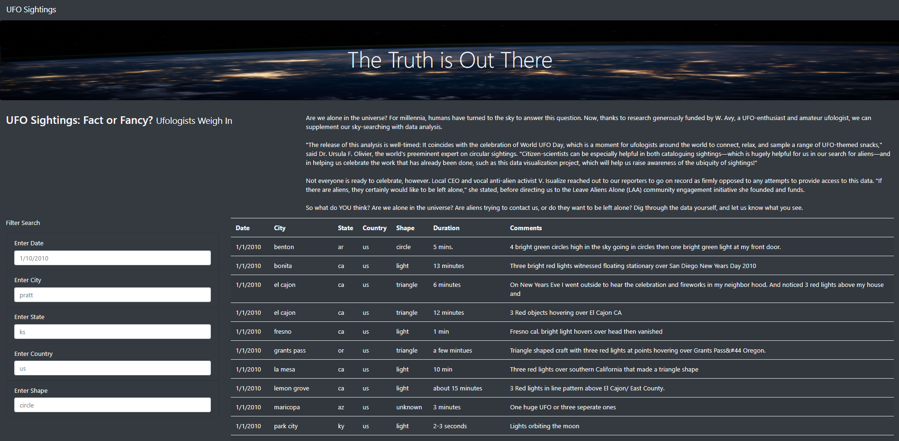
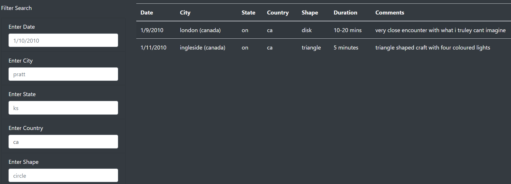
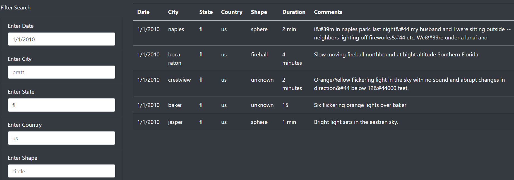

# UFOs

## Overview of the project
The purpose of this project is to create an interactive webpage with a dynamic table to present information around UFO sightings and allow users to filter data using multiple criteria at the same time.
 
## Results
When the webpage is loaded for the first time, all available data around UFO sightings will be displayed. In order to perform a search and filter results, one or more criteria must be chosen. The options are date, City, State, Country and shape. Every field has a hint as to what kind of information is expected. Fill out one or more fields and press the Enter key on your keyboard. The result will be presented on the table to the right of the Filter Search.
  

  
Below is an example of a search for UFO sightings filtered by Country (Canada):
 

  
Below is an example of a search for UFO sightings using the date (1/1/2010) and State (fl) filters:
 

 
## Summary
<ul>
<li>One drawback of this design is that the user does not have a quick way to find out the options available in the dataset for each search criteria. In order to do that, they would have to go through the entire table (presented to the right of the Filter Search) and pick one or more result.</li>
<li>In order to improve this layout, I would change the search fields to a dropdown list to make it easier for the user to see all the options available for each field.</li>
<li>Another improvement to this layout would be to insert a button to clear the fields so that the user can start the search all over again without the need to reload the page.</li>
</ul>   